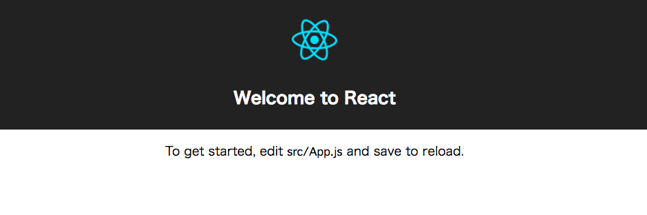

# 【2015年度新人研修】JavaScript Framework入門

以下、2015年度新人研修で使った資料をcreate-react-appで作成した雛形の上にのせられるようにサンプルコードを改変したものです。

## 環境

- Node v6.9.1
- yarn 0.18.1

## はじめに

Webアプリケーションを開発するにあたり、エンドユーザが直感的な操作を行えるよう画面を遷移せずに書き換えたり、操作時間を短縮するためにAjaxで非同期通信を行ったりすることがあるかと思います。そういった機能はユーザ体験を大きく向上させることができ、ここ近年のWebアプリケーションではよりいっそう求められるようになってきました。

例えば、jQueryを使用して実装をしたとします。jQueryはDOM操作を簡単にしてくれるとても便利なライブラリです。最初のうちは問題なく使用できるでしょう。
がしかし、規模が拡大するにつれてコードは複雑さを増していきます。jQueryはアプリケーションのコードを整理するための枠組みは用意してくれません。データはDOMにあるため、テストも困難です。
そこで、規模の拡大とともに複雑化したコードを整理し、テストを行いやすくするため、JavaScriptフレームワークを導入する機会が増えてきました。

本資料では、数あるJavaScriptフレームワークの中でも最近注目されているReactとFluxを例に、JavaScriptフレームワークを用いたWebアプリケーション開発について学んでいきたいと思います。

## Reactとは

[React](http://facebook.github.io/react/)とは、Facebook社とInstagram社が開発した **UIの構築に特化したJavaScriptライブラリ** です。FacebookやInstagramに加え、Yahoo!やAtlassianなど、[様々な企業](https://github.com/facebook/react/wiki/Sites-Using-React)で利用されはじめており、国内でも注目の高いライブラリです。

それでは、早速Reactの特徴を見ていきましょう。

### ビューに特化したライブラリ

「A JavaScript library for building user interfaces」とあるように、ReactはUIを構築するためのライブラリです。これは、MVCアーキテクチャでいうところのV（ビュー）の位置にあてはまります。よって、Reactはフレームワークではなく、既存のライブラリ・フレームワークと組み合わせて使用することができます。

また、React単体でも一定規模の動的なアプリケーションを構築することは可能です。

### 一方向のデータフロー

Reactでは、画面上のすべての要素を **コンポーネント** として定義します。
これは、画面上の要素を実際に線で囲ってみるとイメージしやすいと思います。


上の図のように、画面上の各要素をコンポーネントとして定義します。
コンポーネントはHTMLと同様に階層化されて表現することが出来ます。

また、コンポーネントは基本的には状態を持たず（ **ステートレス** ）、レンダリングするために必要なデータはすべて上位のコンポーネントから渡されます。これにより、コンポーネント単体の再利用性を高め、管理しやすい状態を実現します。
また、コンポーネントのテストも行いやすくなります。

ただし、すべてのコンポーネントがステートレスになってしまうと静的なHTMLと変わりなくなってしまいます。そこで、Reactでは単純なコンポーネント群の上位にある重要なコンポーネントに状態を持たせます（ **ステートフル** ）。この状態をもとに、下位コンポーネント群にデータが渡されてレンダリングが行われます。ユーザから入力があった場合、上位コンポーネントに変更を伝えて状態を変更し、再レンダリングが行われます。


### Virtual DOM

コンポーネントの状態に変更があった際、下位コンポーネント群のレンダリングが行われます。これをそのまま画面に反映しようとすると、状態の変更がある度にDOMツリー全体を再構築する必要があるため、変更する必要がない箇所も都度書き換わってしまいます。
これは単純に処理コストも増えますし、ユーザー体験を大きく損なう可能性があります。

そこで、Reactでは **Virtual DOM** という仕組みでこの問題を解決しています。

すべてのコンポーネントがレンダリングされた際、その結果はVirtual DOMと呼ばれる仮想のDOMツリーに適用されます。仮想のDOMツリーはJavaScriptのメモリ上に存在し、画面とは切り離されて管理されています。そのため、仮想のDOMツリーへの適用は画面の表示に関する再計算等が発生せず、高速に動作します。
最終的に、Reactは仮想のDOMと実際のDOMを比較し、差分結果を自動的に実際のDOMへ適用します。


この仕組みによって、細かなDOMの適用処理を考えなくて済むようになり、設計が単純化します。

## Reactを使ったTODOアプリの実装

さて、Reactの3つの大きな特徴を見てみました。
がしかし、読んだだけでは理解が進まないところがあるかもしれません。

そこで、ここからはシンプルなTODOアプリケーションを具体例に、Reactについてより深く学んでいきたいと思います。実装する内容は以下の通りです。

- すべてのTODOの表示
	- TODO名と作成日の一覧が表示される
- 新しいTODOの作成
	- フォームにTODO名を入力して作成できる
- 作成したTODOの削除
	- それぞれのTODOの削除ボタンから削除できる

また、完成したTODOアプリケーションのソースコードはGitHubにあります。

https://github.com/ufotsuboi/react-todo-app-sample

### 準備

せっかくなのでyarnを使ってみましょう。ということで、npmバージョンとyarnバージョンを併記しておきます。  
yarnのインストールは下記の公式サイトからOSに合った方法でインストールしてください。

https://yarnpkg.com/en/docs/install

create-react-appのインストール

```
# npm
$ npm install -g create-react-app

# yarn
$ yarn global add create-react-app
```

create-react-appを使ってサンプル雛形の作成

```
$ cd your-working-dir
$ create-react-app my-todo-app
```

この時点でcreate-react-appによるアプリが作成されています。  
create-react-appによるひな形では以下の4つのnpm scriptが用意されています。

```
# npm
$ npm start
$ npm run build
$ npm test
$ npm run eject

# yarn
$ yarn start
$ yarn run build
$ yarn test
$ yarn run eject
```

それぞれ、

- start
    - 開発用にサーバーが起動される。ファイルの変更をwatchして再ビルドしてくれる。（基本開発時はこれ。）
- build
    - 本番用にファイルをソースマップ&minifyでビルドしてbuildディレクトリに出力してくれる。
- test
    - testを実行。
- eject
    - react-scriptが持ってくれるWebpackやESLintの設定ファイルを出力してくれる。ただし、これをやると元に戻せないので注意。Webpackのカスタマイズなどが必要になった時に行う。

（注意）macOS sierra向け。  
testを実行した時に以下のようなエラーでコケる場合。

```
Determining test suites to run...2016-12-25 23:42 node[64546] (FSEvents.framework) FSEventStreamStart: register_with_server: ERROR: f2d_register_rpc() => (null) (-22)
2016-12-25 23:42 node[64546] (FSEvents.framework) FSEventStreamStart: register_with_server: ERROR: f2d_register_rpc() => (null) (-22)
2016-12-25 23:42 node[64546] (FSEvents.framework) FSEventStreamStart: register_with_server: ERROR: f2d_register_rpc() => (null) (-22)
2016-12-25 23:42 node[64546] (FSEvents.framework) FSEventStreamStart: register_with_server: ERROR: f2d_register_rpc() => (null) (-22)
2016-12-25 23:42 node[64546] (FSEvents.framework) FSEventStreamStart: register_with_server: ERROR: f2d_register_rpc() => (null) (-22)
2016-12-25 23:42 node[64546] (FSEvents.framework) FSEventStreamStart: register_with_server: ERROR: f2d_register_rpc() => (null) (-22)
2016-12-25 23:42 node[64546] (FSEvents.framework) FSEventStreamStart: register_with_server: ERROR: f2d_register_rpc() => (null) (-22)
2016-12-25 23:42 node[64546] (FSEvents.framework) FSEventStreamStart: register_with_server: ERROR: f2d_register_rpc() => (null) (-22)
2016-12-25 23:42 node[64546] (FSEvents.framework) FSEventStreamStart: register_with_server: ERROR: f2d_register_rpc() => (null) (-22)
2016-12-25 23:42 node[64546] (FSEvents.framework) FSEventStreamStart: register_with_server: ERROR: f2d_register_rpc() => (null) (-22)
2016-12-25 23:42 node[64546] (FSEvents.framework) FSEventStreamStart: register_with_server: ERROR: f2d_register_rpc() => (null) (-22)
2016-12-25 23:42 node[64546] (FSEvents.framework) FSEventStreamStart: register_with_server: ERROR: f2d_register_rpc() => (null) (-22)
events.js:160
      throw er; // Unhandled 'error' event
      ^

Error: Error watching file for changes: EMFILE
    at exports._errnoException (util.js:1022:11)
    at FSEvent.FSWatcher._handle.onchange (fs.js:1406:11)
error Command failed with exit code 1.
```

watchmanが足りない。もしくはsierraにアップデートした時におかしくなっている事があるので、

```
$ brew update
$ brew install watchman (reinstall watchman)
```

することで、testが実行され、watchモードになると思います。


ここでは、Reactを触ることを目的としているので、startで表示されることのみを行い、testなどには触れません。

### まずは表示してみる

では、Reactを使用して画面上に要素を表示してみましょう。  
ここまでで、create-react-appを使って雛形を作成した場合、すでにサンプルアプリが表示されます。

```
# npm
$ npm start

# yarn
$ yarn start
```

3000番ポートで以下の画面が表示されていると思います。



この状態では、ファイルの変更がwatchされ、変更されると自動的に再ビルドされブラウザが更新されます。

```javascript
// ./src/App.js
import React, { Component } from 'react';
import logo from './logo.svg';
import './App.css';

class App extends Component {
  render() {
    return (
      <div className="App">
        <div className="App-header">
          
          <h2>Welcome to React</h2>
        </div>
        <p className="App-intro">
          To get started, edit <code>src/App.js</code> and save to reload.
        </p>
      </div>
    );
  }
}

export default App;
```

試しに、 `<h2>Welcome to React</h2>` を `<h2>Welcome to Todo</h2>` など変えてみましょう。  
自動的にブラウザがリロードされ、変更が確認できたと思います。  
このようにしてTodoアプリを実装していきましょう。

### 初期アプリの説明

前述の通り、Reactでは、ページの構成要素をすべて **Reactコンポーネント** として定義します。  
まずは、TODOアプリケーション全体を囲う要素となる「TodoAppコンポーネント」を定義・表示します。  
`src/TodoApp.js` を以下の内容で新規作成しましょう。

```javascript
// ./src/TodoApp.js
import React, { Component } from 'react';

class TodoApp extends Component {
  render() {
    return (
      <div className="todoApp">
        Hello React! I am a TODO Application.
      </div>
    );
  }
}

export default TodoApp;
```

次にはじめからある `App` ではなく、作成した `TodoApp` コンポーネントを表示するために `src/index.js` を以下のように編集します。

```javascript
// ./src/index.js
import React from 'react';
import ReactDOM from 'react-dom';
import TodoApp from './TodoApp';
import './index.css';

ReactDOM.render(
  <TodoApp />,
  document.getElementById('root')
);
```

上から順にコードを見ていきましょう。

まず、`React.Compoennt` を継承して、TodoAppコンポーネントを定義しています。その定義したTodoAppを `export` してあげると、 `index.js` で `import` して使うことができます。  
import/exportについての説明はおいおいやっていくので、今は `export` したものが、`import` できるでOKです。  

次にReactDOMのrenderメソッドは、コンポーネントが表示される際に呼ばれるメソッドです。必ず1つのコンポーネントを返す必要があります。  
そして、定義したコンポーネントを、`ReactDOM.render` を用いて実際のDOM（今回はdiv#root）に適用しています。

### JSXについて

ここで、コード上にあるXMLのような記述に目がいくかと思います。

ここに書かれている`<div>...</div>`や`<TodoApp />`は実際のHTML/XMLではありません。
Reactでは、 **JSX** というプリコンパイラが用意されており、XMLライクな簡易な記述でReactコンポーネントのインスタンスを作成することができます。このまま実行するとブラウザ側でエラーとなってしまうため、最終的にはXMLライクな記述を素のJavaScriptにプリコンパイルする必要があります。

もちろん、JSXを使用せず、最初から素のJavaScriptで記述することもできます。

```javascript
// ./src/TodoApp.js
import React, { Component } from 'react';

class TodoApp extends Component {
  render() {
    return (
      React.createElement('div', { className: 'todoApp' },
        'Hello, world! I am a TODO Application.'
      )
    );
  }
}

export default TodoApp;
```

```javascript
// ./src/index.js
import React from 'react';
import ReactDOM from 'react-dom';
import TodoApp from './TodoApp';
import './index.css';

ReactDOM.render(
  React.createElement(TodoApp, null),
  document.getElementById('root')
);
```

つまり、`<コンポーネント名 />`という記述は、`React.createElement('コンポーネント名', ...)`でインスタンスを作成するのと同じ結果になります。

JSXを使用するかどうかは開発者によって決めることができます。  
この資料では、より手軽にReactコンポーネントを利用できるJSXの使用を前提に解説していきたいと思います。

### フォームとリストのスケルトン定義

続いて、先ほどのTodoAppコンポーネントと同様に、TODOを作成するための「TodoFormコンポーネント」とすべてのTODOを表示する「TodoListコンポーネント」を定義しましょう。

`./src/TodoForm.js` , `./src/TodoList.js`を作成しましょう。  
まだ中身は実装せず、仮の文字列が表示されるようにしておきます。

```javascript
// ./src/TodoList.js
import React, { Component } from 'react';

class TodoForm extends Component {
  render() {
    return (
      <div className="todoForm">
        I am a TODO Form.
      </div>
    );
  }
}

export default TodoForm;
```

```javascript
// ./src/TodoList.js
import React, { Component } from 'react';

class TodoList extends Component {
  render() {
    return (
      <div className="todoList">
        I am a TODO List.
      </div>
    );
  }
}

export default TodoList;
```

次に、作成した2つのコンポーネントを表示するため、TodoAppコンポーネントにTodoFormとTodoListをimportし、表示するように修正します。

```javascript
// ./src/TodoApp.js
import React, { Component } from 'react';
import TodoForm from './TodoForm';
import TodoList from './TodoList';

class TodoApp extends Component {
  render() {
    return (
      <div className="todoApp">
        <h1>TODO Application</h1>
        <TodoForm />
        <TodoList />
      </div>
    );
  }
}

export default TodoApp;
```

TodoAppコンポーネントにTodoFormコンポーネントとTodoListコンポーネントが含まれ画面上に表示されました。

```コンポーネントの親子関係
TodoApp
  |
  |-- TodoForm
  `-- TodoList
```

このように、Reactではコンポーネントを組み立てて階層化し、画面の構成要素を表現していきます。

### TODOの表示

続いて、1つのTODOを表す「Todoコンポーネント」を定義しましょう。  
`./src/Todo.js` を作成し、親コンポーネントから渡されたTODO名と作成日を表示するようにしてみます。

```javascript
// ./src/Todo.js
import React, { Component, PropTypes } from 'react';

class Todo extends Component {
  render() {
    return (
      <div className="todo">
        <span className="name">{this.props.children}</span>
        <span className="date">{this.props.created_at}</span>
      </div>
    );
  }
}

Todo.propTypes = {
  children: PropTypes.string.isRequired,
  created_at: PropTypes.string.isRequired,
};

export default Todo;
```

親から子へのデータの受け渡しは、コンポーネントの **props** （プロパティ）経由で行います。  
propsは`this.props`でアクセスでき、`this.props.children`がTODO名、`this.props.created_at`が作成日として、表示されています。  
（JSXの中では、波括弧 `{}` を用いてJavaScriptのコードを記述することができます。）

また、`propTypes` では渡ってくるpropsの型を定義できます。定義した型以外の値が渡ってきた場合でもコンソールにwarningが表示されるだけですが、思わぬエラーを産まないためや、そのコンポーネントの使い方が他の人にわかりやすくなるため、出来る限り記述したほうが良いでしょう。  
指定できるPropTypesは以下の様なものがあります。

```
PropTypes.array           // 配列
PropTypes.bool.isRequired // Booleanで必須
PropTypes.func            // 関数
PropTypes.number          // 数値
PropTypes.object          // オブジェクト
PropTypes.string          // 文字列
PropTypes.node            // Renderできるもの
PropTypes.element         // React Element
PropTypes.instanceOf(XXX) // XXXのinstanceかどうか
PropTypes.oneOf(['foo', 'bar']) // fooかbar
PropTypes.oneOfType([PropTypes.string, PropTypes.array]) // 文字列か配列
PropTypes.arrayOf(PropTypes.string)  // 文字列の配列かどうか
PropTypes.objectOf(PropTypes.string) // 文字列の値を持っているか
PropTypes.shape({                          // 指定された形式を満たしているかどうか
  color: PropTypes.string,
  fontSize: PropTypes.number
});
PropTypes.any.isRequired  // なんでもいいけど必須

// カスタムの制約も定義出来る(ダメな場合はError投げる)
customPropType: (props, propName, componentName) => {
  if (!/^[0-9]/.test(props[propName])) {
    return new Error('Validation failed!');
  }
}
```

今回は`children`, `created_at`ともにstringで必須です。

では、TodoListコンポーネントにいくつかのTodoコンポーネントを追加してみましょう。

```javascript
// ./src/TodoList.js
import React, { Component } from 'react';
import Todo from './Todo';

class TodoList extends Component {
  render() {
    return (
      <div className="todoList">
        <Todo created_at="2015/05/01 9:00:00">牛乳を買う</Todo>
        <Todo created_at="2015/05/01 9:00:00">パンを買う</Todo>
      </div>
    );
  }
}

export default TodoList;
```

親のTodoListコンポーネントから子のTodoコンポーネントにいくつかのデータを渡しています。  
例えば、「2015/05/01 9:00:00」をcreated_at属性に、「牛乳を買う」を子ノードに指定して、1つめのTodoコンポーネントに渡しています。

このように、Reactでは親コンポーネントから渡されたデータを元にレンダリングを行い、コンポーネントをステートレスに保ちます。

### TODOの動的表示

先ほどのコードではTodoListコンポーネントの中にTodoコンポーネントをハードコードしていました。これでは静的なHTMLと全く変わりがありません。  
そこで、最上位のコンポーネントであるTodoAppコンポーネントの **state** （状態）としてデータを持たせ、それを使ってTODOを動的に表示するようにしましょう。

まずは、TodoAppコンポーネントのstateの初期値を定義しましょう。

```javascript
// ./src/TodoApp.js
import React, { Component } from 'react';
import TodoForm from './TodoForm';
import TodoList from './TodoList';

class TodoApp extends Component {
  constructor(props) {
    super(props);
    this.state = {
      todo: [],
    };
  }

  render() {
    return (
      <div className="todoApp">
        <h1>TODO Application</h1>
        <TodoForm />
        <TodoList />
      </div>
    );
  }
}

export default TodoApp;
```

`constructor`メソッドをオーバライドして、スーパークラスメソッドを呼び出してから、コンポーネントのstateの初期値を定義します。

次に、先ほどハードコードしていたTODOの内容をstateに設定します。

```javascript
// ./src/TodoApp.js
import React, { Component } from 'react';
import TodoForm from './TodoForm';
import TodoList from './TodoList';

class TodoApp extends Component {
  constructor(props) {
    super(props);
    this.state = {
      todo: [],
    };
  }

  componentDidMount() {
    // NOTE: ここでAjaxを用いてサーバサイドから取得してもよい
    const todos = [
      { id: 'i9tajxy9', name: '牛乳を買う', created_at: '2015/05/01 9:00:00' },
      { id: 'i9ta58tx', name: 'パンを買う', created_at: '2015/05/01 9:00:00' }
    ];

    this.setState({ todos: todos });
  }

  render() {
    return (
      <div className="todoApp">
        <h1>TODO Application</h1>
        <TodoForm />
        <TodoList todos={this.state.todos} />
      </div>
    );
  }
}

export default TodoApp;
```

ここで、`componentDidMount`メソッドを新しく定義しています。componentDidMountメソッドは、コンポーネントがレンダリングされたときに実行されます。  
コンポーネントには **ライフサイクルが** あり、他にもいくつかのメソッドを定義することで、状態の変化に応じて実行されます。

次に、TODOの内容を一度`todos`変数に格納しています。  
今回はサーバサイドとの通信は行いませんが、一般的なアプリケーションの様にAjaxを用いてサーバサイドからデータを取得してもよいでしょう。  
また、それぞれのTODOを特定できるよう、ランダムな`id`を新たに割り振っています。

componentDidMountメソッドの最後で、todosを`setState`でstateに格納しています。  
Reactでは、setStateが呼ばれることで再レンダリングが行われるため、データの更新は必ずsetStateで行いましょう。

そして、格納された`this.state.todos`をTodoListコンポーネントにprops経由で渡しています。

では、TodoAppからprops経由で渡されたstateをもとに、TodoListを修正して、TODOを動的に表示してみましょう。

```javascript
// ./src/TodoList.js
import React, { Component, PropTypes } from 'react';
import Todo from './Todo';

class TodoList extends Component {
  render() {
    const todos = this.props.todos.map(todo => {
      return <Todo key={todo.id} created_at={todo.created_at}>{todo.name}</Todo>;
    });

    return (
      <div className="todoList">
        {todos}
      </div>
    );
  }
}

TodoList.propTypes = {
  todos: PropTypes.array.isRequired,
};

export default TodoList;
```

親コンポーネントから渡されたtodosを繰り返し処理し、Todoコンポーネントを組み立てています。

ここで、新たにTodoコンポーネントに`key`を指定しています。  
TodoListコンポーネントのような同じコンポーネントを複数並べる構成の場合、`key`にそれぞれユニークな値を与える必要があります。keyを指定することによって、ReactはVirtual DOMと実際のDOMを比較しやすくなり、最小限の変更だけ実際のDOMに適用することができるからです。

このようにして、Reactでは最上位のコンポーネントにstateを持たせ、それに基づいて下位コンポーネント群の動的な組み立てを行います。

### TODOの作成

ここまででTODOの表示を行うことができました。  
今度は、フォーム上から新しいTODOを作成できるようにしてみましょう。

TodoFormコンポーネントにTODO名の入力欄と送信ボタンを定義していきます。

```javascript
// ./src/TodoForm.js
import React, { Component } from 'react';

class TodoForm extends Component {
  render() {
    return (
      <form className="todoForm">
        <input type="text" placeholder="TODOを入力..." />
        <button type="submit">作成</button>
      </form>
    );
  }
}

export default TodoForm;
```

シンプルなフォームが表示されました。

次に、フォームのsubmitイベントをハンドリングできるようにします。

```javascript
// ./src/TodoForm.js
import React, { Component } from 'react';

class TodoForm extends Component {
  handleSubmit(e) {
    e.preventDefault();
  }

  render() {
    return (
      <form className="todoForm" onSubmit={this.handleSubmit.bind(this)}>
        <input type="text" placeholder="TODOを入力..." />
        <button type="submit">作成</button>
      </form>
    );
  }
}

export default TodoForm;
```

Reactでは、`on + イベント名`属性でイベントハンドラをコンポーネントに結びつけることができます。ここでは、フォームのsubmitイベントが発生すると`handleSubmit`メソッドが実行されます。  
また、ブラウザのデフォルトアクションを抑止するため、イベントオブジェクトの`preventDefault()`を呼び出しています。（このあたりは、jQueryをはじめ、他ライブラリ・フレームワークと同様に考えることができます。）

次に値を取得したいinputにref属性を指定して、フォームの値を `handleSubmit` メソッド内で取得しましょう。

```javascript
// ./src/TodoForm.js
import React, { Component } from 'react';

class TodoForm extends Component {
  handleSubmit(e) {
    e.preventDefault();

    // Todoの追加処理（今はコンソールに表示しているだけ）
    console.log(this.input.value);
    // フォームの初期化
    this.input.value = '';
  }

  render() {
    return (
      <form className="todoForm" onSubmit={this.handleSubmit.bind(this)}>
        <input type="text" placeholder="TODOを入力..." ref={c => this.input = c} />
        <button type="submit">作成</button>
      </form>
    );
  }
}

export default TodoForm;
```

`ref属性`に関数を渡すと、そのノードのDOMオブジェクトを引数に渡した関数が実行されます。そのDOMをクラスメンバ変数 `this.input` に格納して、イベントハンドラからinputのDOMオブジェクトにアクセスできるようにします。  
このままではフォームに値が残ったままになっているので、最後に`this.input.value`を空にすることでフォームに入力した値がクリアされます。

（寄り道）今回ref属性に渡す関数にはアロー関数の省略系を利用しています。

```javascript
// functionを使った書き方
function(c) {
  this.input = c;
}

// アロー関数省略なし
(c) => {
  this.input = c;
}

// 引数が1つの場合は()省略可
c => {
  this.input = c;
}

// ブロックが一行の場合こういった書き方もする
c => this.input = c;
```

なお、functionとアロー関数で内部の `this` が違うのですが、ここでは詳しく触れませんので、興味がある方は調べてみてください。

では、入力された内容をもとに、TODOを作成していきましょう。

```javascript
// ./src/TodoApp.js
import React, { Component } from 'react';
import TodoForm from './TodoForm';
import TodoList from './TodoList';

class TodoApp extends Component {
  constructor(props) {
    super(props);
    this.state = {
      todos: [],
    };
  }

  componentDidMount() {
    // NOTE: ここでAjaxを用いてサーバサイドから取得してもよい
    const todos = [
      { id: 'i9tajxy9', name: '牛乳を買う', created_at: '2015/05/01 9:00:00' },
      { id: 'i9ta58tx', name: 'パンを買う', created_at: '2015/05/01 9:00:00' }
    ];

    this.setState({ todos: todos });
  }

  createTodo(name) {
    // TODO: ここでTODOの作成処理を行う
  }

  render() {
    return (
      <div className="todoApp">
        <h1>TODO Application</h1>
        <TodoForm create={this.createTodo.bind(this)} />
        <TodoList todos={this.state.todos} />
      </div>
    );
  }
}

export default TodoApp;
```

TODOのデータはTodoAppコンポーネントのstateとして持っているため、TodoAppコンポーネント自身がTODOを作成するのがよいでしょう。そこで、TODOを作成するための`todoCreate`メソッドを定義し、子コンポーネントから実行してもらうことにします。  
TODOの表示と同様に、イベントハンドラについてもprops経由で親から子コンポーネントに渡します。

渡されたTodoForm側を見てみましょう。

```javascript
// ./src/TodoForm.js
import React, { Component, PropTypes } from 'react';

class TodoForm extends Component {
  handleSubmit(e) {
    e.preventDefault();

    // Todoの追加処理
    if (this.input.value !== '') {
      this.props.create(this.input.value.trim());
    }
    // フォームの初期化
    this.input.value = '';
  }

  render() {
    return (
      <form className="todoForm" onSubmit={this.handleSubmit.bind(this)}>
        <input type="text" placeholder="TODOを入力..." ref={c => this.input = c} />
        <button type="submit">作成</button>
      </form>
    );
  }
}

TodoForm.propTypes = {
  create: PropTypes.func.isRequired,
};

export default TodoForm;
```

TodoFormコンポーネントでは、入力された内容が空ではない場合に、propsの`create`を呼び出しています。すなわち、TodoAppコンポーネントの`createTodo`メソッドです。

最後に、TODOの作成処理の実装です。

```javascript
// ./src/TodoApp.js
import React, { Component } from 'react';
import TodoForm from './TodoForm';
import TodoList from './TodoList';

class TodoApp extends Component {
  constructor(props) {
    super(props);
    this.state = {
      todos: [],
    };
  }

  componentDidMount() {
    // NOTE: ここでAjaxを用いてサーバサイドから取得してもよい
    const todos = [
      { id: 'i9tajxy9', name: '牛乳を買う', created_at: '2015/05/01 9:00:00' },
      { id: 'i9ta58tx', name: 'パンを買う', created_at: '2015/05/01 9:00:00' }
    ];

    this.setState({ todos: todos });
  }

  createTodo(name) {
    // NOTE: ここでAjaxを用いてサーバサイドに送信・作成してもよい
    const todo = {
      id: (Date.now() + Math.floor(Math.random() * 999999)).toString(36),
      name: name,
      created_at: (new Date()).toLocaleString()
    };

    this.setState({ todos: this.state.todos.concat([todo]) });
  }

  render() {
    return (
      <div className="todoApp">
        <h1>TODO Application</h1>
        <TodoForm create={this.createTodo.bind(this)} />
        <TodoList todos={this.state.todos} />
      </div>
    );
  }
}

export default TodoApp;
```

`todoCreate`メソッドでは、渡された名前を元にTODOのデータを作成し、`todo`変数に格納しています。（`id`は、ランダムな文字列を取得して指定しています。`created_at`は現在の日付から人間が読みやすい文字列に変換しています。）  
そして、`this.state`を破壊しないよう、`concat`で新しい配列を作成して`setState`メソッドでstateを更新しています。

一見すると、`todos`が新しい配列になり、画面に表示されているTODO群がすべて再レンダリングされるように感じるかもしれません。Reactでは、Virtual DOMによる差分適用が自動的にされるため、todos全体を更新しても新しく作成したTODOのみ実際のDOMツリーに追加されます。

このように、Reactでは実際のDOMを意識することなくデータを富豪的に更新することができるのです。

### TODOの削除

いよいよ最後の実装になります。作成されたTODOを削除できるボタンを追加しましょう。

まずはTodoコンポーネントに削除ボタンを定義していきます。  
先ほどのフォームと同様に、イベントハンドラも定義します。

```javascript
// ./src/Todo.js
import React, { Component, PropTypes } from 'react';

class Todo extends Component {
  handleRemove(e) {
    e.preventDefault();
  }

  render() {
    return (
      <div className="todo">
        <span className="name">{this.props.children}</span>
        <span className="date">{this.props.created_at}</span>
        <button onClick={this.handleRemove.bind(this)}>削除</button>
      </div>
    );
  }
}

Todo.propTypes = {
  children: PropTypes.string.isRequired,
  created_at: PropTypes.string.isRequired,
};

export default Todo;
```

まだなにも動作しない削除ボタンが定義できました。

続いて削除処理の実装です。

```javascript
// ./src/TodoApp.js
import React, { Component } from 'react';
import TodoForm from './TodoForm';
import TodoList from './TodoList';

class TodoApp extends Component {
  constructor(props) {
    super(props);
    this.state = {
      todos: [],
    };
  }

  componentDidMount() {
    // NOTE: ここでAjaxを用いてサーバサイドから取得してもよい
    const todos = [
      { id: 'i9tajxy9', name: '牛乳を買う', created_at: '2015/05/01 9:00:00' },
      { id: 'i9ta58tx', name: 'パンを買う', created_at: '2015/05/01 9:00:00' }
    ];

    this.setState({ todos: todos });
  }

  createTodo(name) {
    // NOTE: ここでAjaxを用いてサーバサイドに送信・作成してもよい
    const todo = {
      id: (Date.now() + Math.floor(Math.random() * 999999)).toString(36),
      name: name,
      created_at: (new Date()).toLocaleString()
    };

    this.setState({ todos: this.state.todos.concat([todo]) });
  }
  
  removeTodo(id) {
    // TODO: ここでTODOの削除処理を行う
  }

  render() {
    return (
      <div className="todoApp">
        <h1>TODO Application</h1>
        <TodoForm create={this.createTodo.bind(this)} />
        <TodoList todos={this.state.todos} remove={this.removeTodo.bind(this)} />
      </div>
    );
  }
}

export default TodoApp;
```

作成時と同様、TodoAppコンポーネント自身がTODOを削除するのがよいでしょう。`removeTodo`メソッドを定義し、TodoListコンポーネントを経由してTodoコンポーネントに渡します。

TodoListコンポーネントを見てみましょう。

```javascript
// ./src/TodoList.js
import React, { Component, PropTypes } from 'react';
import Todo from './Todo';

class TodoList extends Component {
  render() {
    const todos = this.props.todos.map(todo => {
      return <Todo key={todo.id} id={todo.id} created_at={todo.created_at} remove={this.props.remove}>{todo.name}</Todo>;
    });

    return (
      <div className="todoList">
        {todos}
      </div>
    );
  }
}

TodoList.propTypes = {
  todos: PropTypes.array.isRequired,
  remove: PropTypes.func.isRequired,
};

export default TodoList;
```

ここでは受け取ったイベントハンドラをそのままTodoコンポーネントに渡しています。  
また、TODOの削除は`id`で判別するため、新たに`id`を渡しています。

Todoコンポーネントを修正します。

```javascript
// ./src/Todo.js
import React, { Component, PropTypes } from 'react';

class Todo extends Component {
  handleRemove(e) {
    e.preventDefault();

    this.props.remove(this.props.id);
  }

  render() {
    return (
      <div className="todo">
        <span className="name">{this.props.children}</span>
        <span className="date">{this.props.created_at}</span>
        <button onClick={this.handleRemove.bind(this)}>削除</button>
      </div>
    );
  }
}

Todo.propTypes = {
  id: PropTypes.string.isRequired,
  children: PropTypes.string.isRequired,
  created_at: PropTypes.string.isRequired,
  remove: PropTypes.func.isRequired,
};

export default Todo;
```

TodoListコンポーネントから渡された`remove`を実行しています。これで、TODOの作成と同様に、子コンポーネントから親のstateを更新しています。

最後に、TodoAppで削除しましょう。

```javascript
// ./src/TodoApp.js
import React, { Component } from 'react';
import TodoForm from './TodoForm';
import TodoList from './TodoList';

class TodoApp extends Component {
  constructor(props) {
    super(props);
    this.state = {
      todos: [],
    };
  }

  componentDidMount() {
    // NOTE: ここでAjaxを用いてサーバサイドから取得してもよい
    const todos = [
      { id: 'i9tajxy9', name: '牛乳を買う', created_at: '2015/05/01 9:00:00' },
      { id: 'i9ta58tx', name: 'パンを買う', created_at: '2015/05/01 9:00:00' }
    ];

    this.setState({ todos: todos });
  }

  createTodo(name) {
    // NOTE: ここでAjaxを用いてサーバサイドに送信・作成してもよい
    const todo = {
      id: (Date.now() + Math.floor(Math.random() * 999999)).toString(36),
      name: name,
      created_at: (new Date()).toLocaleString()
    };

    this.setState({ todos: this.state.todos.concat([todo]) });
  }
  
  removeTodo(id) {
    // NOTE: ここでAjaxを用いてサーバサイドに送信・削除してもよい
    const newTodos = this.state.todos.filter(todo => todo.id !== id);

    this.setState({ todos: newTodos });
  }
  
  render() {
    return (
      <div className="todoApp">
        <h1>TODO Application</h1>
        <TodoForm create={this.createTodo.bind(this)} />
        <TodoList todos={this.state.todos} remove={this.removeTodo.bind(this)} />
      </div>
    );
  }
}

export default TodoApp;
```

stateの`todos`を`filter`メソッドで削除対象以外のものに絞り込みをして新しい配列を`newTodos`に格納しています。あとは、TODOの作成と同様に、`setState`メソッドでstateを更新するだけです。

お疲れ様でした。以上でTODOアプリケーションの実装が完了しました！

### 実装してみて

Reactを使うと、DOMを意識することなく画面の各要素を組み立てて表示できることがわかりました。表示処理は明示的に行う必要はなく、すべてReact任せです。また、各コンポーネントは渡ってきたデータをもとに表示するだけなので、とてもシンプルでテストしやすい状態になります。

一方、以下の点が気になると思います。

- TODOの削除を行うためのイベントハンドラを、TodoApp => TodoList => Todo、のように順に引き継いでいかなければならない
- TODOの追加やTODOの削除などのビジネスロジックがTodoAppコンポーネントに集中してしまう

これでは、アプリケーションの要件が増えるにつれてメンテナンス性が悪くなってしまいますね。  
ReactはあくまでUIに特化したライブラリのため、これらの問題に対する解決策は提示していません。

ではどうしたらよいでしょうか。そこで、 **Flux** の登場です。が、今回は細かいことを抜きにして、Reactをさわってみようということでここまでです。今後、随時資料追加予定なのでお楽しみに。


### おまけ

この他にも例えば以下のような機能を実装して自分なりのTODOアプリを作ってみてください。

- TODOリストのソート機能
- TODOの状態管理（TODO/INPROGRESS/DONE）
- TODOリストの絞込機能
- TODOアプリにスタイルをあてる

create-react-appのデフォルト設定でのスタイルのあてかたについて簡単な説明を用意したのでこちらも参考ください。

### スタイルをあてる

create-react-appではWebpackでcssや画像ファイルも読み込めるようにloaderが設定されています。デフォルトのAppコンポーネントを見てみましょう。

```javascript
// ./src/App.js
import React, { Component } from 'react';
import logo from './logo.svg';
import './App.css';

class App extends Component {
  render() {
    return (
      <div className="App">
        <div className="App-header">
          
          <h2>Welcome to Todo</h2>
        </div>
        <p className="App-intro">
          To get started, edit <code>src/App.js</code> and save to reload.
        </p>
      </div>
    );
  }
}

export default App;
```

`logo.svg` , `App.css` がimportされています。 `App.css`は

```css
// ./src/App.css
.App {
  text-align: center;
}

.App-logo {
  animation: App-logo-spin infinite 20s linear;
  height: 80px;
}

.App-header {
  background-color: #222;
  height: 150px;
  padding: 20px;
  color: white;
}

.App-intro {
  font-size: large;
}

@keyframes App-logo-spin {
  from { transform: rotate(0deg); }
  to { transform: rotate(360deg); }
}
```

このように通常のCSSファイルとなっています。create-react-appの設定ではimportしたcssを読み込んでくれるだけですが、Webpackの設定で読み込む際にクラスにハッシュ値を付与して、擬似的なローカルスコープにすることもできます。(CSS Modules)

CSS Modulesについては詳しくは触れませんが、`TodoApp.css` などを追加して、作成したTodoアプリにスタイルを当ててみると良いでしょう。

